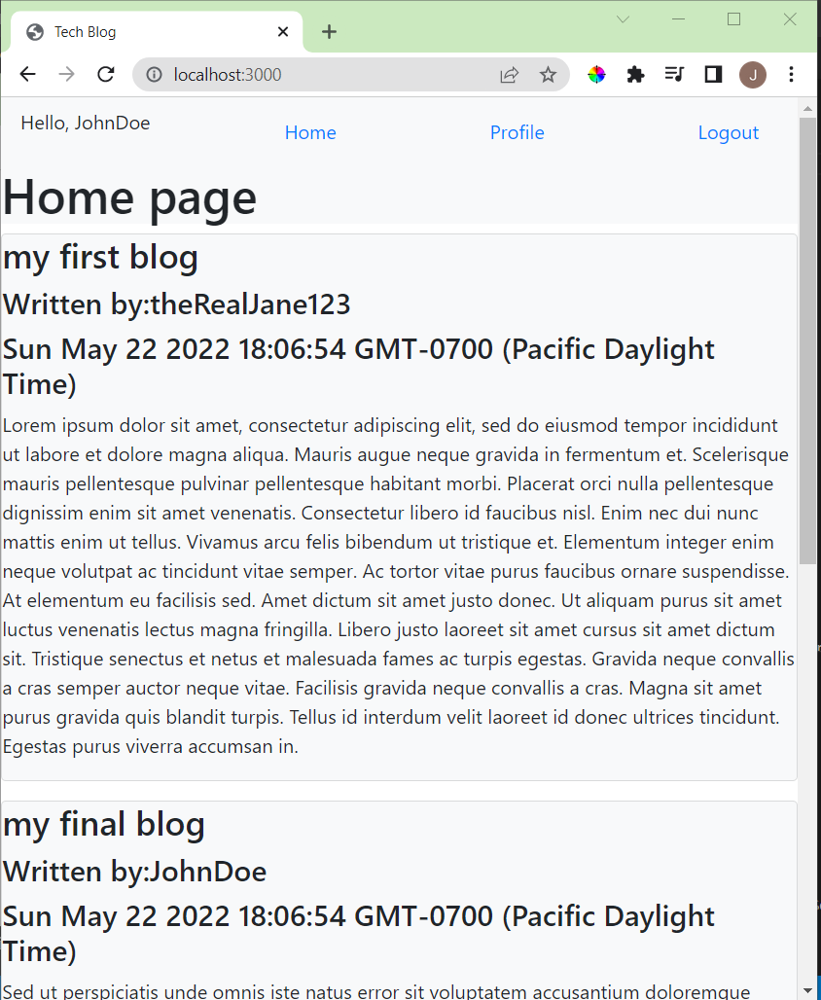

# Tech-Blog

## Description
This is a a simple blog website. On the home page you will see a list of all the blog posts that are currently in the database. Routes setup for users and blog posts. You can delete your blog posts from your home page. Styled with handlebars and bootstrap. 

## Deployed Link
https://secret-atoll-57844.herokuapp.com/

## Table of Contents
- [Installation](#installation)
- [Contribution](#contribution)
- [License](#license)
- [Contact](#contact)

## Installation
Run "npm i" in the terminal to install the required packages. After the packages are installed type "npm run seed" in order to setup the seeds within the database for testing. After the seed file has been run you can run "node server.js" to view the website in localhost:3000. Alternatively, you can checkout the website on the deployed heroku application. 

## Contribution
All coding provided by Jeff Hicks. 

## License
This project is licensed with MIT License. 

## Contact
- Author: Jeff Hicks
- Email: hicks.jeff@me.com
- Github: https://github.com/jixxin